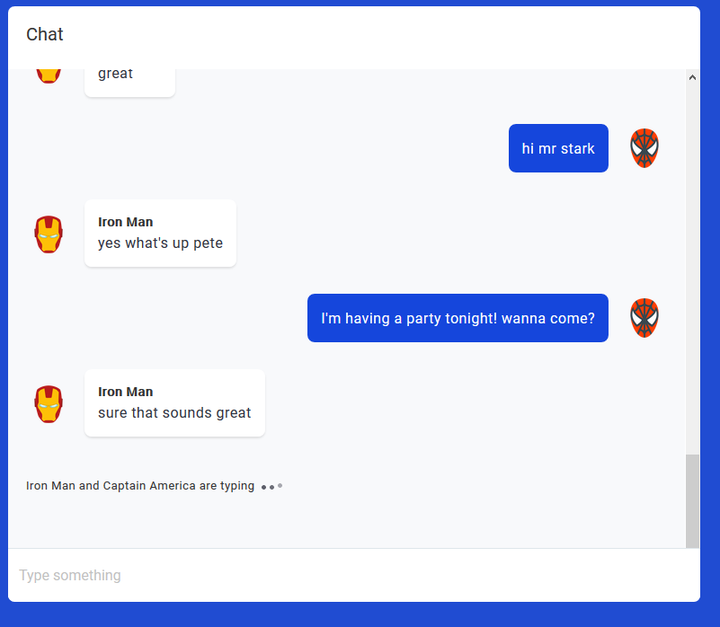

# React Chat App With Typing Indicator Using CometChat PRO

This sample app shows how to build a React chat application using CometChat Pro SDK that will show typing indicator when another user is typing a message

SCREENSHOTS




Jump straight into the code or read the accompanying step-by-step guide here on our blog.

## Technology

This demo uses:

* React
* CometChat Pro JavaScript SDK
* Typing animation in CSS by [Jimmy Yoon](https://codepen.io/jyoon93/pen/POoPeM)

## Running the demo locally

* Download the repository [here](https://github.com/cometchat-pro-tutorials/react-typing-indicators/archive/master.zip) or run `git clone https://github.com/cometchat-pro-tutorials/react-typing-indicators.git`
* In the `react-typing-indicators` directory, run `npm install`
* You need to sign up for CometChat PRO and create your application first
* Create an ApiKey. You can use auth-only permission for this application
* Create a Group from the dashboard
* Create a `.env` file in the root folder of the project and paste the following content in it:

```
REACT_APP_COMETCHAT_API_KEY=YOUR_API_KEY
REACT_APP_COMETCHAT_APP_ID=YOUR_APP_ID
REACT_APP_COMETCHAT_GUID=YOUR_GROUP_GUID
```

Replace `YOUR_API_KEY`, `YOUR_APP_ID` and `YOUR_GROUP_GUID` with your API KEY, APP ID and GUID as obtained from your CometChat dashboard.

* run `npm start`

## Useful links

* [📚Tutorial](https://prodocs.cometchat.com/docs)

## Other examples

* [ReactJS Chat app](https://github.com/cometchat-pro/javascript-reactjs-chat-app)